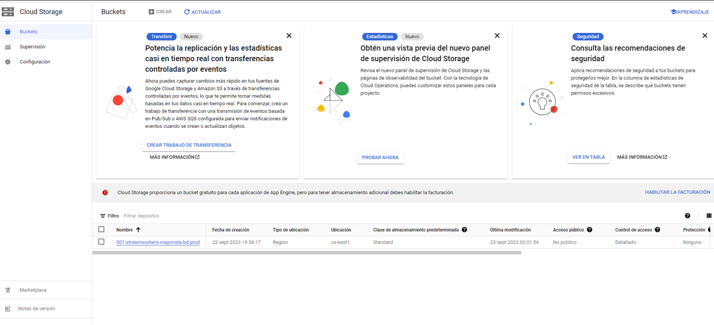
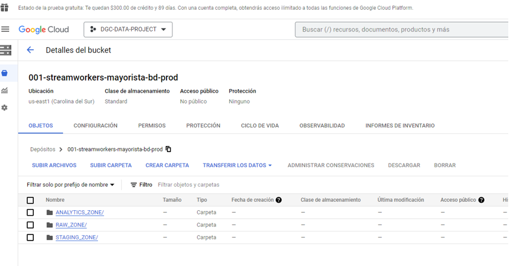
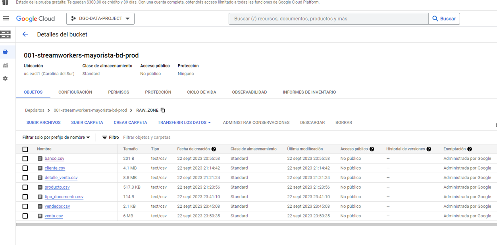
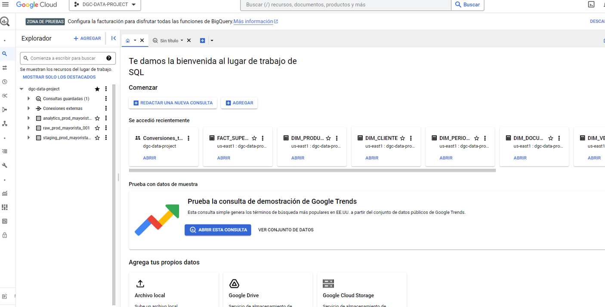
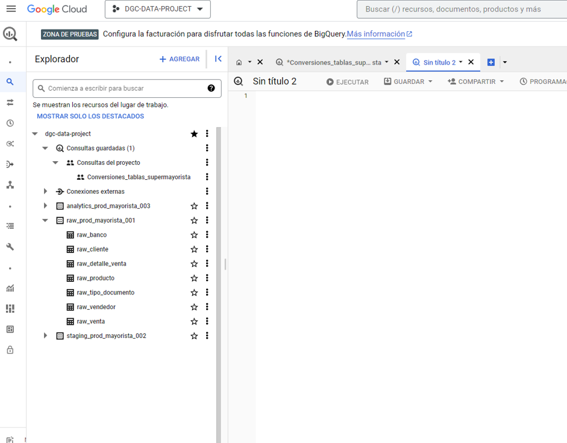
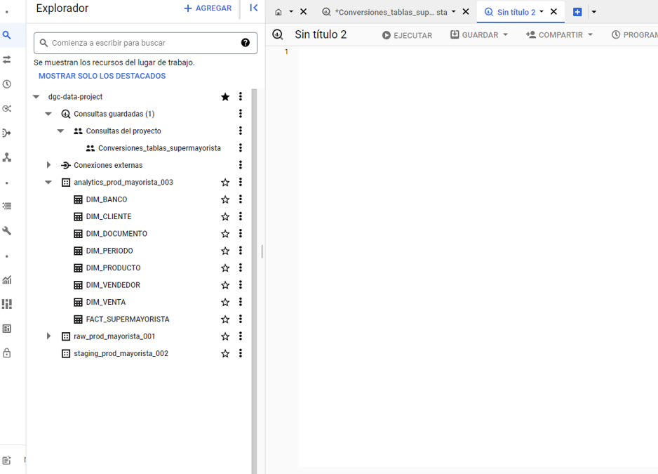

  <h1>Supermayorista con GCP <b><i><a href="https://www.ibm.com/docs/es/ida/9.1.2?topic=schemas-snowflake" target="_blank">[Modelo Estrella]</a></i></b></h1>

 
  

## Tabla de contenido
- [Creación del bucket](#Cloud_Storage)
- [Creación de los datasets en BigQuery](#BigQuery)
- [ETL "Supermayorista GCP"](#ETL-SupermayoristaGCP)
  - [FLUJO_DIM_DOCUMENTO](#FLUJO_DIM_DOCUMENTO)
  - [FLUJO_DIM_VENDEDOR](#FLUJO_DIM_VENDEDOR)
  - [FLUJO_DIM_VENTA](#FLUJO_DIM_VENTA)
  - [FLUJO_DIM_BANCO](#FLUJO_DIM_BANCO)
  - [FLUJO_DIM_PERIODO](#FLUJO_DIM_PERIODO)
  - [FLUJO_DIM_CATEGORIA](#FLUJO_DIM_CATEGORIA)
  - [FLUJO_DIM_SUBCATEGORIA](#FLUJO_DIM_SUBCATEGORIA)
  - [FLUJO_DIM_PRODUCTO](#FLUJO_DIM_PRODUCTO)
  - [FLUJO_DIM_DEPARTAMENTO](#FLUJO_DIM_DEPARTAMENTO)
  - [FLUJO_DIM_DISTRITO](#FLUJO_DIM_DISTRITO)
  - [FLUJO_DIM_CLIENTE](#FLUJO_DIM_CLIENTE)
  - [FLUJO_FACT_SUPERMAYORISTA](#FLUJO_FACT_SUPERMAYORISTA)

# Cloud_Storage

 
  

 
  

 
  

# BigQuery

 
  

 
  

 
  

# ETL **_SupermayoristaGCP_**

 
  

## FLUJO_DIM_DOCUMENTO

 
  

## FLUJO_DIM_VENDEDOR

 
  

## FLUJO_DIM_VENTA

 
  

## FLUJO_DIM_BANCO
  

 
  

 ## FLUJO_DIM_PERIODO

 
  

 ## FLUJO_DIM_CATEGORIA
  

 
  

## FLUJO_DIM_SUBCATEGORIA

 
  

## FLUJO_DIM_PRODUCTO

 
  

## FLUJO_DIM_DEPARTAMENTO

## FLUJO_DIM_DISTRITO

 
  

## FLUJO_DIM_CLIENTE

 
  

## FLUJO_FACT_SUPERMAYORISTA

 
  

